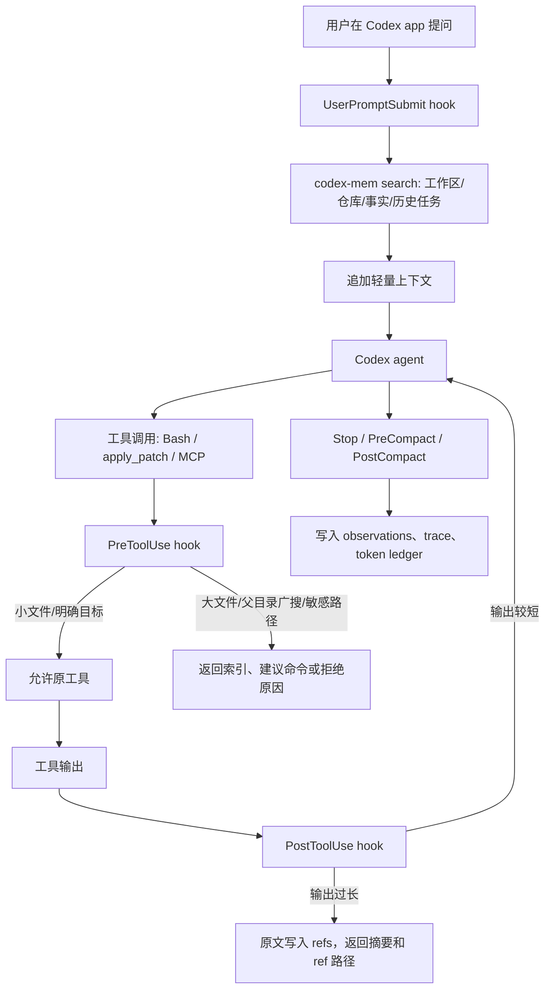

# Codex-mem 适配设计

日期：2026-06-06

## 判断

可以基于 `claude-mem` 的思路做 Codex app 适配，但不建议直接 fork 后改少量 hook 名称。原因是两边的生命周期入口不同：

- `claude-mem` 主要依赖 Claude Code hooks，适合捕获 Claude Code 的 session、prompt、工具调用和文件读取。
- Codex app/CLI 已有自己的 hooks 体系，可以放在 `~/.codex/hooks.json`、`~/.codex/config.toml`、`<repo>/.codex/hooks.json`、`<repo>/.codex/config.toml`，也可以由插件携带。
- Codex hooks 可以在 `SessionStart`、`UserPromptSubmit`、`PreToolUse`、`PostToolUse`、`PreCompact`、`PostCompact`、`Stop` 等事件运行脚本。
- `PreToolUse` 可以拦截 Bash、`apply_patch` 和 MCP 工具调用，并可给模型增加上下文、拒绝工具调用或改写部分工具输入。
- `PostToolUse` 可以在工具产出后运行，能把原始工具结果替换成 hook 给的反馈，适合处理长日志、长搜索结果和大文件读取结果。
- 限制也很明确：Codex 文档说明 `PreToolUse` / `PostToolUse` 还不能完整拦截所有 shell 路径，尤其新版 `unified_exec` 机制拦截不完整，也不拦截 WebSearch。

所以更合适的产品形态是：

```text
ai-context-kit
  + codex-mem plugin
  + codex-mem MCP
  + codex hooks
  + SQLite/FTS 本地索引
  + project-facts / CodeGraph / refs
```

## 当前实现状态

`ai-context-kit` v0.3.9 已实现第一版 observe 模式和接口契约索引：

- `codex-mem init`：创建 `.codex-mem/` 本地目录和轻量索引。
- `codex-mem index`：从父目录 `AGENTS.md`、`docs/ai-context-*.md`、子仓库 `AGENTS.md`、`project-facts/*.md` 生成 `index.jsonl`。
- `codex-mem search`：按关键词搜索本地轻量索引。
- `codex-mem install-hooks --mode observe`：生成项目级 `.codex/hooks.json` 和 `.codex/hooks/codex-mem-hook.mjs`。
- `codex-mem install-user-hooks --mode observe`：为非 Git 父目录生成用户级 guarded hooks，只记录目标 workspace 内的 Codex 任务。
- `codex-mem dashboard`：从 `.codex-mem/ledger.jsonl` 生成 `docs/codex-mem-dashboard.md`。
- `codex-mem sessions`：从 `$CODEX_HOME/sessions/**/*.jsonl` 生成 `docs/codex-session-usage.md`，用于 A/B 会话 token、状态和失败消息对比。
- `codex-mem exec-events`：从 `codex exec --json` 事件文件生成 `docs/codex-exec-events.md`，用于记录 raw exec 的 status、MCP/tool 调用、usage 和失败消息；多个事件文件会生成基准对比表。
- `docs/ai-context-api-contract-map.md`：把前端 endpoint 和后端 Controller、请求 DTO 字段、响应类型放在同一张静态索引表里。
- Java 仓库 `project-facts/api-contract-map.md`：列出 Controller route、请求 DTO 字段和响应类型，供字段契约检查使用。
- `contracts --query <endpoint-or-symbol>`：从工作区和后端契约索引中精确筛选 endpoint、符号、DTO、Handler、页面或 API wrapper，并根据前端 import 或服务调用提示同页面相关接口，避免模型整段读取契约索引。
- observe hook 已把契约索引整段读取、前端 UI 库、监控插件、minified 文件、SQL 目录和 VM 模板纳入高噪声提示。

observe 模式只记录 token 估算和给出轻量提示，不拦截工具调用。`compress` 模式在 v0.3.10 已有 refs/offload smoke 实现：长输出可写入本地 refs，返回 ref 路径、hash 和预览；v0.3.11 增加 `codex-mem get`，可按路径或 hash 回读本地 ref；v0.3.12 增加本地 stdio MCP smoke 第一版；v0.3.13 增加 Codex MCP 配置片段生成器；v0.3.14 增加 `Content-Length` framed stdio 支持；v0.3.15 修正 MCP search/route 在索引缺失时退出 server 的问题；v0.3.16 增加 API 契约行索引；v0.3.17 增加中文业务词到英文代码词的查询扩展；v0.3.18 让 API 契约行带结构化 `contract/relatedRepos`，并让 route 同时推荐前端和后端仓库；v0.3.19 扩展 TS/React/Next 常见 service/import/request 写法的静态识别；v0.3.20 给 `contracts` 增加前端仓库、后端仓库和同页面相关类型筛选；v0.3.21 修正相关类型分类并增加 `codex-mem route --query` CLI；v0.3.22 增加规则版 `redact`；v0.3.23 增强 compress 结构化摘要；v0.3.24 增加 CLI `codex-mem timeline --limit`；v0.3.25 支持前端 API wrapper 内的局部路径常量、字符串拼接和简单模板字符串；v0.3.26 增加 CLI `codex-mem record`；v0.3.27 将 read-only MCP 工具默认 approval 改为真实 exec 已验证的 `approve`；v0.3.28 增加轻量 context graph JSON；v0.3.29 尝试把 `agents` 限制为只生成 `AGENTS.md`，但后续验证发现这会让“项目缺流程材料”的场景不完整；v0.3.30 让 `doctor` 输出缺失工作流工件，并让顶层 `init` 同时生成 `.codex-mem/index.jsonl`，使 route/search 在初始化后可直接使用；v0.3.31 扩展 contracts 前端扫描，覆盖 SDK-style REST client、GraphQL `gql`/`graphql` operation 和 Next/React-style `actions.ts`；v0.3.32 增加常见 `baseURL` / API prefix 推断，用于匹配前端相对路径和后端 Controller；v0.3.33 给 `codex-mem search/route` 增加结构化字段权重，先改善 JSONL 排序再评估 SQLite/FTS；v0.3.34 将 `agents` 改为按缺失项生成 workflow artifacts，并增加同义命令 `repair`，只缺 AGENTS 时不会重写已有 workspace map；v0.3.35 增加前端页面调用 payload 字段索引；v0.3.36 增加前端 payload 与后端 DTO 的字段差异提示；v0.3.37 让 `doctor` 标出缺少新版契约列的旧契约表，并推荐 `init` 刷新；v0.3.38 同步标出旧 `codex-mem` api-contract entry，避免 route/search 继续使用旧字段结构；v0.3.39 让直接查询命令也输出 stale warning；v0.3.40 给 `codex-mem sessions` 增加按 session id 过滤和选中 session 对比段；v0.3.42 给 session 报告增加 status/error 和 failed/warning 汇总；v0.3.43 增加 raw `codex exec --json` events 摘要；v0.3.44 修正旧 usage total 缺失和 MCP 工具分布重复计数；v0.3.45 增加 raw events 多文件基准对比；v0.3.46 增加真实任务记录审计。还需要真实任务 A/B 验证后再给团队启用。

## 和 claude-mem 的能力映射

| claude-mem 能力 | Codex 适配方式 | 第一版建议 |
| --- | --- | --- |
| Session lifecycle capture | `SessionStart`、`Stop`、`PreCompact`、`PostCompact` hooks | 做 |
| Prompt capture | `UserPromptSubmit` hook | 做，但只存摘要和检索关键词 |
| Tool use capture | `PreToolUse`、`PostToolUse` hooks | 做，先观察再启用拦截 |
| MCP 三层检索：search / timeline / get | 自建 `codex-mem` MCP server | 做 |
| File Read Gate | `PreToolUse` 拦截 Bash/MCP 文件读取，`PostToolUse` 压缩大结果 | 做，但不能宣称 100% 拦截 |
| Chroma/vector memory | SQLite FTS 起步，embedding 可选 | 先不用 |
| Endless Mode | Codex 自带 compaction + `PreCompact/PostCompact` 辅助 | 暂不做 |

## 推荐架构



## Codex hook 设计

### SessionStart

用途：

- 检测当前目录是单仓库还是多仓库父目录。
- 如果存在 `docs/ai-context-workspace-map.md`、`project-facts/project.md`，追加短上下文，提醒先读索引。
- 如果当前从 `/kt` 这类父目录启动，提示先路由到子仓库。

输出方式：

- 返回 `hookSpecificOutput.additionalContext`。
- 内容控制在几百 tokens，不把完整索引塞进去。

### UserPromptSubmit

用途：

- 对用户 prompt 做关键词抽取：页面名、接口路径、Controller、表名、错误码、仓库名。
- 用 `codex-mem search` 查本地索引，返回前 5 条轻量命中。
- 如果 prompt 涉及多端联调，只返回相关仓库和可能入口，不返回源码。

输出方式：

- 返回 `additionalContext`，例如：

```text
codex-mem matched:
- repo: kt-server, likely API: /api/order/refund, map: docs/ai-context/api-endpoints.md
- repo: kt-applet, likely page: pages/order/detail.vue
Use these indexes before broad source search.
```

### PreToolUse

用途：

- 对 Bash、`apply_patch`、MCP 文件工具做前置检查。
- 拦截常见高 token 操作：
  - 在父目录执行无约束 `rg`、`find`、`ls -R`。
  - `cat`/`sed`/`nl` 读取大文件、构建产物、依赖目录、敏感配置。
  - MCP `read_file` 读取超过阈值的大文件。

处理策略：

- `observe` 模式：不阻止，只返回 `additionalContext`，记录原命令预计 token。
- `enforce` 模式：对明显浪费的读取返回 `permissionDecision: "deny"`，提示使用 `codex-mem search` 或 `ai-context-kit summary`。
- 对可安全改写的命令，返回 `permissionDecision: "allow"` + `updatedInput`，例如把父目录 `rg keyword .` 改成只查命中的子仓库。

注意：

- Codex 官方文档说明 `PreToolUse` 不是完整安全边界，也不能拦截 WebSearch。
- 它适合减少常见浪费，不适合当作唯一控制点。

### PostToolUse

用途：

- 捕获 Bash/MCP 输出。
- 如果输出超过阈值，把原文写到本地 `refs/`，返回短摘要、路径、hash、可复读命令。
- 用 `continue: false` 或 `decision: "block"` 让 Codex 从压缩结果继续，而不是把长输出直接送进模型。
- 当前 v0.3.27 smoke 实现已覆盖：长输出写 refs、ledger 记录 `refPath/outputHash/outputSummary/compressedOutputTokens`、`codex-mem get` 回读、`codex-mem timeline --limit` 查看最近 hook/ref/hash/摘要提示、`codex-mem record` 写 observations 并可被 search/timeline 读取、dashboard 展示 refs 事件、敏感路径不写 refs、本地 MCP `search/get/route/timeline/record`、Codex MCP 配置片段生成、read-only MCP 工具 `approve` 配置生成、framed stdio 输入输出、MCP no-index 空结果、workspace API 契约行 `api-contract` index entry、中文业务词扩展、跨端契约 route 同时推荐前端和后端仓库、`codex-mem route --query` CLI、规则版 `redact`、TS service/default/namespace import/request/fetch 静态识别、局部路径常量/字符串拼接/简单模板字符串 endpoint 识别，以及 `contracts --frontend-repo/--backend-repo/--related` 筛选。
- 仍待实现：更好的摘要策略、跨会话 trace 关联、真实任务 A/B。

建议阈值：

- 单次输出超过 8k tokens：写入 refs，只返回摘要。
- 单次输出超过 30k tokens：强制写入 refs，并提醒改用更窄查询。
- 命中 secret、`.env`、`application*.yml`、`*.pem`、`*.key`：当前不写 refs，只记录 `refSkipped: sensitive-path`。

### PreCompact / PostCompact

用途：

- 在压缩前保存当前任务 trace。
- 压缩后记录新的摘要、相关文件、验证命令和未解决问题。

这部分适合借鉴 `TencentDB-Agent-Memory` 的 refs 思路：上层只保留路径和判断，下层保留原始证据。

### Stop

用途：

- 在每轮结束时写 `observations`：
  - 用户目标。
  - 最终改动或判断。
  - 读过的关键文件。
  - 运行过的验证。
  - token ledger：原始输出估算、压缩后估算、节省比例。
- v0.3.50 起返回本地 token snapshot：静态 dashboard 路径、当前 session 内工具输入/输出估算、大输出事件数和压缩收益估算。
- 不强行续跑任务，除非配置了“必须验证”的团队策略。

## 存储设计

建议先用本地 SQLite，不引入向量库：

```text
.codex-mem/
  mem.sqlite
  refs/
    2026-06-06/
      <turn-id>-<tool-use-id>.md
  ledger.jsonl
```

核心表：

| 表 | 用途 |
| --- | --- |
| `workspace_items` | 父目录、子仓库、语言、框架、入口文档 |
| `observations` | 任务观察、文件观察、接口观察 |
| `tool_events` | 工具调用、原始 token、压缩 token、ref path |
| `file_summaries` | 文件摘要、mtime、hash、符号索引 |
| `facts_index` | `project-facts`、CodeGraph、route map 的轻量索引 |

第一版不建议把源码全文存入数据库。存路径、hash、摘要、符号和 refs 路径即可。

## MCP 工具设计

建议暴露 5 个工具：

| 工具 | 返回内容 | 作用 |
| --- | --- | --- |
| `codex_mem_search(query, limit)` | 命中项、仓库、路径、摘要、token 估算 | 替代父目录广搜的第一步 |
| `codex_mem_timeline(limit)` | 最近 hook 事件和 observations | 看最近压缩、跳过和记录了什么 |
| `codex_mem_get(ref, maxChars)` | 取 ref 详情，默认限制返回长度 | 按需取详情 |
| `codex_mem_route(prompt, limit)` | 推荐子仓库和索引文档 | 处理 `/kt` 这类父目录启动 |
| `codex_mem_record(title, summary, repo, path, tags)` | 写 observations | 任务中记录可检索事实 |

这个 MCP 不替代 CodeGraph。CodeGraph 仍负责代码结构和符号查询，`codex-mem` 负责“什么时候该查哪个仓库、先看什么、哪些输出不要重复进上下文”。

## 团队接入方式

推荐做成 `ai-context-kit` 的一个子能力：

```bash
ai-context-kit codex-mem init --workspace /path/to/workspace
ai-context-kit codex-mem index --workspace /path/to/workspace
ai-context-kit codex-mem install-hooks --workspace /path/to/workspace --mode observe
ai-context-kit codex-mem install-user-hooks --workspace /path/to/workspace --mode observe
ai-context-kit codex-mem timeline --workspace /path/to/workspace --limit 20
ai-context-kit codex-mem record --workspace /path/to/workspace --title "Finding" --summary "Short observation"
ai-context-kit codex-mem dashboard --workspace /path/to/workspace
ai-context-kit codex-mem sessions --workspace /path/to/workspace
ai-context-kit codex-mem exec-events --workspace /path/to/workspace --events /tmp/codex-events.jsonl
```

生成内容：

```text
<workspace>/.codex/hooks.json
<workspace>/.codex/hooks/*.js
<workspace>/.codex/config.toml
<workspace>/.codex-mem/
```

实测注意：如果 workspace 是 `/kt` 这类多仓库父目录，但父目录自身没有 `.git`，Codex CLI 会要求 `exec --skip-git-repo-check`。如果同时启用 `$CODEX_HOME/hooks.json` 和 `<workspace>/.codex/hooks.json`，同一个事件可能触发两条 hook 命令，因此 hook 脚本需要重复事件过滤。

| 做法 | 适合场景 | 风险 |
| --- | --- | --- |
| `install-user-hooks` | 不想把父目录变成 Git 仓库，但要记录 `/kt` 下真实任务 | 写入 `$CODEX_HOME/hooks.json`，需要用户在 Codex app/CLI 中信任 hooks |
| 给父目录建立管理 Git 仓库 | 团队愿意把父目录路由文档版本化 | 需要规划顶层仓库的提交范围，不能把子仓库内容混进去 |

2026-06-06 对 Codex CLI 0.137.0-alpha.4 的验证结果：

- `codex-mem install-hooks` 能生成项目 `.codex/hooks.json`，脚本手工执行能写入 ledger。
- `<kt-workspace>` 加入 `~/.codex/config.toml` trusted 后，CLI 仍要求 `exec --skip-git-repo-check`，因为父目录本身不是 Git 仓库。
- 非 managed hooks 要先在 Codex CLI 的 hooks review/trust 流程中信任；只加 `--dangerously-bypass-hook-trust` 不会让未启用 hooks 自动执行。
- 信任后，`codex exec --skip-git-repo-check` smoke test 已能写入 `SessionStart`、`UserPromptSubmit`、`PreToolUse`、`PostToolUse`、`Stop`。
- `ai-context-kit` v0.3.6 在 hook 写入阶段加入文件锁和重复事件过滤，dashboard 统计时也会忽略旧重复事件。
- 当前可稳定使用 `codex-mem sessions` 做会话 token、状态和失败消息统计，用 `codex-mem exec-events` 摘要 raw exec 事件文件，用 hooks ledger 做工具输入/输出估算；Stop hook 的本地 token snapshot 只用于即时可见性，正式 A/B 需要按任务时间窗口取数。

如果要做成可分发插件：

```text
codex-mem-plugin/
  .codex-plugin/plugin.json
  hooks/hooks.json
  hooks/*.js
  skills/codex-mem/SKILL.md
  mcp/server.js
```

Codex 文档说明插件可以携带 hooks，插件 hook 可通过 `PLUGIN_ROOT` 和 `PLUGIN_DATA` 找到安装目录和可写数据目录。团队分发时插件更方便；单项目试点时项目 `.codex/` 更直观。

## 对 KT 项目的预期

`<kt-workspace>` 已经有第一阶段数据：

- 父目录全量基线：`26,902,543` tokens。
- 父目录路由：`2,141` tokens。
- 目标仓库轻量上下文：约 `3,962` 到 `4,070` tokens。
- 完整接口索引：约 `21,862` 到 `98,961` tokens。

Codex-mem 不会替代这些收益，主要增加第二类收益：

- 减少后续工具输出重复进入上下文。
- 减少同事在同一仓库重复解释项目结构。
- 减少大文件读取、大日志读取、父目录广搜。
- 让新线程通过 `observations + route + project-facts` 更快进入目标区域。

## 准确度保护

为了避免“省 token 但答错”，第一版需要遵守这些规则：

- 小文件和明确目标文件允许直接读，尤其是即将编辑的文件。
- 对业务代码的摘要必须带原始路径、hash、mtime，必要时可以取回原文。
- 修改前必须让模型拿到足够的目标代码，不只看摘要。
- 只压缩工具输出，不压缩用户需求和已批准项目事实。
- 对配置、密钥、证书文件默认拒绝读取或只允许本地私有记录。
- dashboard 同时展示 token 节省和任务成功率，不能只展示节省比例。

## 第一版实施计划

1. 在 `ai-context-kit` 增加 `codex-mem` 命令组。
2. 做 SQLite/FTS 索引，先吃 `AGENTS.md`、`project-facts/`、`docs/ai-context-*.md`、CodeGraph 产物摘要。
3. 做 `UserPromptSubmit` 和 `SessionStart` hooks，只追加轻量上下文，不拦截工具。
4. 做 `PostToolUse` observe 模式，记录工具输出 token 和 refs，不替换输出。
5. 在 KT 上跑 3 类真实任务：后端 bug、小程序联调、跨端字段问题。
6. 打开 `PostToolUse` 压缩模式，对超过阈值的输出写 refs 并返回摘要。v0.3.10 已有 smoke 实现，待真实任务验证。
7. 最后再打开 `PreToolUse` enforce 模式，限制父目录广搜和大文件直读。

## 风险

| 风险 | 处理 |
| --- | --- |
| Codex 内部文件读取不走可拦截工具 | 通过 Skill/AGENTS/MCP 改团队工作流，hook 只管可拦截路径 |
| 压缩漏掉关键错误 | 先 observe，再 A/B；摘要必须带原始 refs |
| hook 太慢影响开发体验 | hook 只做本地检索和 token 估算，重索引异步由 CLI 做 |
| 团队不信任自动拦截 | 默认 observe，dashboard 显示“原始输出/压缩输出/任务结果” |
| 共享记忆写入敏感信息 | 默认禁读敏感路径，refs 分本地私有和可提交两类 |

## 结论

Codex app 的 hooks 足够支撑一个 `claude-mem` 风格的轻量适配版，尤其适合：

- 启动时给模型短项目索引。
- 提问时自动路由到子仓库。
- 工具输出过长时写 refs 并返回摘要。
- 把每轮任务结果沉淀为可检索 observations。

它不能做到的是“透明拦截 Codex app 里所有上下文进入模型”。所以第一版目标应定为：在不牺牲准确度的前提下，减少可控路径里的重复阅读和长输出，而不是宣称完整替换 Codex 的上下文管理。

## 参考

- [OpenAI Codex Hooks](https://developers.openai.com/codex/hooks)，2026-06-06 查看。
- [OpenAI Codex Advanced Configuration](https://developers.openai.com/codex/config-advanced)，2026-06-06 查看。
- [thedotmack/claude-mem](https://github.com/thedotmack/claude-mem)，2026-06-06 查看 README/docs。
