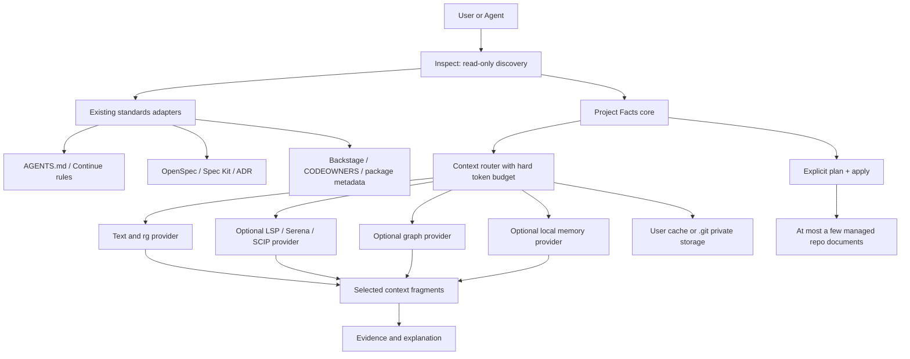

# Project Facts Kit 通用性、效果与低侵入调研报告

- 调研日期：2026-07-15
- 本地基线：`main`，提交 `297525e`
- 调研对象：Project Facts Kit、`ai-context-kit` CLI、两个共享 Skill、模板、安装脚本、Codex plugin 分发目录
- 外部资料范围：项目官方文档、官方仓库、许可证文件；未采用媒体测评和社区二手结论
- 目标：提高跨项目适用性、上下文选择效果，并减少对目标仓库的文件写入和工具依赖

基线说明：第 2 节记录的是提交 `297525e` 的调研快照。调研完成后，用户以 Tool/library owner 身份接受 Phase A，实施结果见第 12、13 节；原始问题描述保留用于追溯。

## 1. 核心判断

当前项目的方向有实际价值。市面上的成熟项目通常只覆盖其中一层：

- Spec Kit、OpenSpec 管需求和变更规格。
- AGENTS.md、Continue Rules 管 Agent 指令。
- Aider、Serena、SCIP 管代码检索和符号关系。
- Backstage、MADR 管 ownership、元数据和决策记录。
- OpenViking、Graphiti、Mem0 管长期上下文或记忆。
- Repomix 管仓库内容打包与 token 测量。

本次调研覆盖的公开项目中，未发现一个项目同时提供“人工确认的项目事实、验证证据、低 token 读取路径、多仓库选择、Skill 反馈评审、可选代码索引和可选记忆”。Project Facts Kit 的差异点成立，但当前实现把这些能力集中在一个 CLI 和一套安装流程中，导致共享核心范围偏大。

建议把产品定义调整为：

> 一个不绑定模型和 IDE 的项目上下文协议与路由器。它优先读取已有标准，只在用户明确应用计划时写入少量事实文件。代码索引、图谱、token 测量、会话记忆和团队目录通过适配器提供，默认不进入业务仓库。

优先级最高的工作不是增加新的知识图谱或 RAG，而是修正当前命令、版本、写入所有权和分发一致性。完成这些工作后，再增加有 token 上限的动态检索和 LSP/SCIP 适配器。OpenViking、Graphiti、GitNexus 一类能力适合后续实验，不适合成为默认依赖。

## 2. 证据边界

### 2.1 已确认的本地事实

1. npm 包版本是 `0.3.55`，主 plugin manifest 版本是 `0.3.59`。来源：[packages/ai-context-kit/package.json](../../packages/ai-context-kit/package.json)、[plugins/project-facts-kit/.codex-plugin/plugin.json](../../plugins/project-facts-kit/.codex-plugin/plugin.json)。
2. 当前 CLI 帮助列出 `onboard`、`upgrade`、`doctor`、`init`、`repair`、`facts`、`agents`、`measure`、`tokens`、`summary`、`dashboard`、`token-status`、`editor-tasks`、`automation-prompt`、`contracts`、`real-task-audit`、`graph`、`redact`、`codegraph` 和 `codex-mem`。主 plugin 的 Skill 文案包含当前 CLI 没有提供的 `status`、`audit` 等调用。来源：[ai-context-kit.mjs](../../packages/ai-context-kit/bin/ai-context-kit.mjs)、[plugin Skill](../../plugins/project-facts-kit/skills/low-token-context-maintainer/SKILL.md)。
3. `--lite` 仍会写入 9 个 `project-facts/` 内容文件、1 个 `AGENTS.fragment.md` 和 2 个目标仓库脚本。来源：[install-project-facts.sh](../../scripts/install-project-facts.sh)。
4. CLI 文件当前为 6978 行，命令分发、仓库识别、渲染、memory、token 测量和诊断共处一个文件。来源：[ai-context-kit.mjs](../../packages/ai-context-kit/bin/ai-context-kit.mjs)。
5. 仓库技术识别主要覆盖 Maven/Java、Go、Vue、uni-app 和 Node；任意 `manifest.json` 都会参与 uni-app 判断；部分角色名称由仓库名中的业务词决定。来源：[ai-context-kit.mjs](../../packages/ai-context-kit/bin/ai-context-kit.mjs)。
6. `skills/`、`plugins/project-facts-kit/skills/`、`plugins/project-facts-kit-codex/skills/` 存在多份可编辑副本，当前内容有差异。检查脚本主要验证 `plugins/project-facts-kit-codex/`，没有对主 marketplace plugin 做等价检查。来源：[check-kit.sh](../../scripts/check-kit.sh)。
7. token 测量使用 `repomix@latest`，并关闭 Repomix 默认安全扫描。来源：[ai-context-kit.mjs](../../packages/ai-context-kit/bin/ai-context-kit.mjs)。
8. 当前真实任务 A/B 审计有 2 条候选记录，但 counted records 为 0，现阶段不能宣称减少 token 的同时保持了任务质量。来源：[ai-context-kit-real-task-ab-audit.md](../ai-context-kit-real-task-ab-audit.md)。

### 2.2 推论和建议的状态

调研完成时，本文中的架构、命令和路线建议只是调研结论。随后用户以 Tool/library owner 身份接受 `SFC-20260715-universal-low-intrusion-phase-a`，授权实现版本与命令 contract、只读发现、helper 写入边界、生成文件 ownership、Skill/Plugin 单一来源和 Repomix 安全配置。动态检索、更多语言 provider、CodeGraph/RAG 和 memory layer 没有随 Phase A 获得接受记录。

## 3. 当前项目评估

### 3.1 值得保留的能力

| 能力 | 价值 | 保留方式 |
| --- | --- | --- |
| 人工批准事实与 AI 推断分离 | 防止把模型总结当成业务规则 | 继续作为核心规则 |
| 来源、验证、unknown、owner 记录 | 支持追溯和交接 | 缩减字段后保留 |
| 父目录多仓库选择 | 多项目工作区中确实能减少无关读取 | 改成只读发现和动态路由 |
| 轻量事实与完整索引分层 | 方向符合按需读取 | 由固定文件清单改成 token 预算选择 |
| Skill 反馈候选评审 | 防止项目专属规则进入共享 Skill | 继续保留，但作为维护者流程 |
| 不覆盖已有事实 | 对 brownfield 项目必要 | 扩展到所有不受管文件 |
| 本地优先 | 适合私有代码和离线环境 | 作为默认部署属性 |

### 3.2 影响普适性的事项

| 等级 | 事项 | 当前影响 | 建议 |
| --- | --- | --- | --- |
| P0 | CLI、文档、Skill、plugin 版本和命令不一致 | 用户会执行不存在的命令，升级行为无法预测 | 用单一版本源和 CLI contract 测试生成所有分发元数据 |
| P0 | 安装默认写入范围偏大 | 首次接入会在业务仓库增加事实目录、脚本和指令片段 | 增加零写入 `inspect`，将写入改为显式 `plan` + `apply` |
| P0 | 受管文件保护不完整 | 父目录 `docs/ai-context-*.md` 可能与业务文档重名 | 所有写入统一检查 managed marker、hash 和创建者 |
| P0 | 多份 Skill 源有差异 | 用户通过不同渠道安装后得到不同规则 | 只维护一份源文件，其他目录由构建任务生成并检查差异 |
| P1 | 技术栈和角色识别范围窄 | Python、Rust、.NET、PHP、Flutter、复杂 monorepo 只能得到弱结果；业务词可能产生误分类 | 使用 detector adapter，识别不充分时返回通用角色，不生成具体业务判断 |
| P1 | 上下文选择以固定文件集为主 | 大项目仍可能读入与任务无关的完整 Markdown 索引 | 引入 query-aware、symbol-aware、token-budgeted 排序 |
| P1 | 生成内容以中文和现有业务栈为中心 | 影响国际团队与通用模板复用 | 数据字段与展示语言分离，默认跟随仓库或显式 `--locale` |
| P1 | Repomix 使用浮动版本并关闭安全检查 | 测量不可复现，打包内容的敏感信息风险增加 | 固定已验证版本，默认保留 Secretlint，必要时由用户显式关闭 |
| P1 | 6978 行单文件 | 单个命令变化容易影响其他功能，测试和发布难度增加 | 按 core、discovery、render、adapter、command、storage 模块组织 |
| P2 | CodeGraph、memory、hooks 与核心 CLI 耦合 | 用户即使只需要项目事实，也要理解大量可选能力 | 通过 capability provider 注册，可选安装、可选启用 |
| P2 | 效果证据不足 | 可以证明工具能生成文件，尚不能证明真实任务质量与 token 收益 | 建立跨语言、跨仓库和已有标准项目的真实任务 A/B 数据集 |

### 3.3 “低侵入”应有明确指标

低侵入不只表示“不覆盖旧文件”，还应同时满足：

- 默认命令写入 0 个文件。
- core profile 新增不超过 4 个受管文档，不新增脚本。
- 生成索引、向量、图谱和会话记录默认写入用户缓存或 `.git/` 私有目录，不进入 Git 工作区。
- 已存在 AGENTS.md、OpenSpec、Spec Kit、ADR、Backstage metadata 时优先建立映射，不创建第二套同类事实。
- 所有写入先显示路径、类型、来源和是否会提交到 Git。
- 未带 managed marker 的同名文件永不自动更新。
- 卸载只删除状态清单中由本工具创建且 hash 未变化的文件。

## 4. 市场分层

本调研没有用 GitHub star 数量直接判断质量。主要观察公开协议、边界清晰度、跨工具能力、文档、许可证、可复现安装方式和目标仓库写入范围。

| 项目/标准 | 主要层次 | 与本项目关系 | 目标仓库负担 | 成熟度判断 | 建议 |
| --- | --- | --- | --- | --- | --- |
| [AGENTS.md](https://agents.md/) | Agent 指令 | 直接相关 | 低，通常一个 Markdown，可按目录设置 | 成熟开放格式 | 直接兼容，作为路由入口 |
| [GitHub Spec Kit](https://github.github.com/spec-kit/index.html) | SDD 工作流 | 事实与规格治理的相邻项目 | 中到高，生成命令和规格结构 | 成熟、生态完整 | 学习扩展和 generic integration，不作为默认依赖 |
| [OpenSpec](https://github.com/Fission-AI/OpenSpec) | 轻量 SDD | 最接近的规格治理项目 | 中，按 change 创建 proposal/spec/design/tasks | 活跃且跨 Agent | 提供适配器，避免重复规格目录 |
| [MADR](https://adr.github.io/madr/) | 决策记录 | 与 decisions/unknowns 相邻 | 低，一个 ADR 一份 Markdown | 成熟、结构简洁 | 兼容已有 ADR，不再创造专用决策格式 |
| [Backstage Software Catalog](https://backstage.io/docs/features/software-catalog/) | 团队元数据与 ownership | 与 owner、仓库角色、服务关系相邻 | 仓库端低，平台端高 | 成熟的组织级平台 | 读取 `catalog-info.yaml`，不要内置 Backstage 服务 |
| [Aider Repository Map](https://aider.chat/docs/repomap.html) | token 受限代码地图 | 与低 token 路由直接相关 | 低，运行时生成 | 成熟、方法清晰 | 优先借鉴其动态排序原则 |
| [Serena](https://github.com/oraios/serena) | LSP 语义检索与编辑 | 可替代部分静态索引 | 低到中，主要是本地配置和索引 | 活跃、语言覆盖广 | 作为可选 provider |
| [SCIP](https://github.com/scip-code/scip) | 代码智能交换协议 | 可作为索引中间格式 | 低到中，索引文件可放缓存 | 成熟协议与多语言 indexer | 作为标准接口，不自行实现各语言解析器 |
| [Continue](https://docs.continue.dev/guides/codebase-documentation-awareness) | Agent rules 与代码感知 | 与 rules、RAG 路由相邻 | 低到中 | 活跃，但检索接口发生过迁移 | 学习 adapter 隔离，避免绑定某一 retrieval API |
| [Repomix](https://github.com/yamadashy/repomix) | 仓库打包与 token 统计 | 当前已有依赖 | 默认生成一个打包文件 | 成熟、功能专一 | 保留为测量 provider，固定版本并启用安全扫描 |
| [OpenViking](https://docs.openviking.ai/en/concepts/01-architecture) | context database | 与分层上下文和 memory 相邻 | 仓库端可低，运行依赖较高 | 新兴、架构完整 | 借鉴 L0/L1/L2，暂不设为核心依赖 |
| [Graphiti](https://github.com/getzep/graphiti) | 时序知识图谱 | 与事实演变和 provenance 相邻 | 需要图数据库、模型与 embedding | 活跃、运行成本较高 | 只做 memory provider 实验 |
| [Mem0](https://github.com/mem0ai/mem0) | 通用 Agent memory | 与用户/会话/Agent 记忆相邻 | 需要 memory 基础设施 | 活跃、非代码库专用 | 研究记忆隔离，不进入事实核心 |
| [Understand Anything](https://github.com/Egonex-AI/Understand-Anything) | 代码知识图谱与可视化 | 与 CodeGraph/RAG 相邻 | 首次分析 token 高，可提交较大 JSON | 新兴、功能发展快 | 观察并做隔离测试 |
| [GitNexus](https://github.com/nxpatterns/gitnexus) | 本地代码图谱、MCP、Graph RAG | 与 CodeGraph/RAG 直接相关 | 索引默认本地，依赖图数据库与 embedding | 新兴、功能广 | 仅研究；许可证限制商业使用 |

## 5. 重点项目分析

### 5.1 AGENTS.md：共享入口应短、分层、就近生效

[AGENTS.md 官方说明](https://agents.md/)允许在 monorepo 子目录放置更具体的文件，离目标文件最近的指令优先。格式没有必填字段，这使它适合做跨 Agent 的入口，但不适合承载大量重复事实。

Codex 自身仓库进一步要求模型可见上下文必须有明确上限，单个注入项不能超过 10K token，超过 1K token 的新增片段要按高优先级人工评审，见 [OpenAI Codex AGENTS.md](https://github.com/openai/codex/blob/main/AGENTS.md#model-visible-context)。这与本项目追求低 token 的方向一致，也说明“生成更多 Markdown，再全部注入”不是有效路线。

对本项目的启示：

- 根 AGENTS.md 只保留仓库身份、读取顺序、禁止事项和验证入口。
- 具体业务事实仍放在来源文件，不复制进 AGENTS.md。
- 已有 AGENTS.md 时只生成 merge plan 或 patch，由用户确认后应用。
- 子项目规则由目录范围决定，不在父目录文件枚举所有细节。

### 5.2 Spec Kit：扩展机制值得参考，默认流程偏重

[GitHub Spec Kit](https://github.github.com/spec-kit/index.html)提供 30+ Agent 集成、generic integration、presets、extensions 和 workflows，也支持离线与组织私有目录。其强项是从 Specify、Plan、Tasks 到 Implement 的完整 SDD 流程，以及围绕流程建立扩展生态。

适合参考：

- core process 与 integration 分离。
- 不认识的 Agent 使用 generic integration，不阻止使用。
- preset/extension 有独立目录和版本，不把所有能力塞进核心命令。
- 工作流阶段和生成物有明确 contract。

不建议照搬：

- Project Facts Kit 主要服务已有项目和事实交接，强制完整 SDD 会增加 Markdown 数量。
- 已接入 Spec Kit 的项目不应再生成平行规格目录。
- 默认安装不应创建每个 Agent 的命令文件。

### 5.3 OpenSpec：最适合作为规格兼容对象

[OpenSpec](https://github.com/Fission-AI/OpenSpec)把一次变更组织为 proposal、specs、design 和 tasks，完成后 archive；它强调 brownfield、跨 Agent 和可迭代修改。与 Project Facts Kit 的 `changes/`、`specs/`、verification 关系最接近。

建议增加 `openspec` adapter：

- 将 OpenSpec proposal 视为变更意图来源。
- 将 specs 中的 requirements/scenarios 映射为 approved requirement 候选，不自动提升为已批准事实。
- 将 tasks 映射为执行进度，不复制到 iteration-plan。
- 将 archive 作为历史来源，不重复生成 change archive。
- audit 只检查引用和状态关系，不改 OpenSpec 文件。

Project Facts Kit 可以继续负责运行事实、发布证据、unknowns 和跨项目交接，这些不是 OpenSpec 的主要范围。

### 5.4 MADR 与 Backstage：优先复用现有决策和 ownership

[MADR](https://adr.github.io/madr/)提供轻量 Markdown 决策模板，核心字段是上下文、候选方案和决策结果。它已足够表达多数架构决策。目标项目存在 `docs/decisions/`、`adr/` 或 MADR front matter 时，本项目只需索引和引用。

[Backstage Software Catalog](https://backstage.io/docs/features/software-catalog/)以版本库中的 YAML 作为软件组件 metadata 来源，团队通过正常 Git 流程维护 ownership。Project Facts Kit 不需要复制组件名、owner、system、dependency 等字段，可读取 `catalog-info.yaml` 并在 project facts 中保留引用。

建议的字段优先级：

1. 已有标准文件中的 owner/decision。
2. 项目明确配置的 owner/decision。
3. Git remote、CODEOWNERS、package metadata 等可观察线索，状态标为 observed。
4. 无可靠来源时保持 unknown，不按目录名推断业务 owner。

### 5.5 Aider Repository Map：低 token 路由的首要参考

[Aider Repository Map](https://aider.chat/docs/repomap.html)不会把完整仓库地图固定注入上下文。它提取类、方法、函数和签名，建立文件依赖图，再按当前对话相关性和 active token budget 选择片段。`--map-tokens` 默认约 1K，并会根据当前上下文动态调整。

本项目当前主要在 routing、lean、full index 三组固定文件间选择。下一阶段可以改为：

1. 先用任务、仓库 metadata、路径和 git diff 选择候选仓库。
2. 从 AGENTS、facts、symbol、contract、recent change 中产生小粒度片段。
3. 为每个片段记录 source、scope、freshness、authority、task relevance 和 token estimate。
4. 在硬 token 上限内排序，返回“为什么选中”和“下一层如何读取”。
5. 只有检索不足时才读完整索引或源码文件。

这一能力能直接提高效果，并减少目标仓库文件数量。排序索引可以保存在用户缓存中，无需提交完整 workspace map。

### 5.6 Serena 与 SCIP：不要自行维护所有语言的解析逻辑

[Serena](https://github.com/oraios/serena)通过 LSP 提供 symbol overview、find symbol、find references、declaration、implementation 和符号级编辑。官方说明其 language server backend 覆盖 40 多种语言，并支持 global、project、client context 和动态 mode 配置。

[SCIP](https://github.com/scip-code/scip)是语言无关的代码智能协议，公开 indexer 覆盖 Java/Scala/Kotlin、TypeScript/JavaScript、Rust、C/C++、Ruby、Python、.NET、Dart 和 PHP。

建议定义统一 provider 接口：

```text
capabilities()
index_status(repo)
symbols(query, budget)
references(symbol, budget)
related_files(query, budget)
freshness(repo)
```

provider 可由简单文本搜索、LSP/Serena、SCIP 或后续 CodeGraph 实现。core 只依赖接口和能力发现。没有 provider 时继续使用 `rg` 与 package metadata，不提示用户必须安装图谱工具。

### 5.7 Continue：检索接口会变化，适配层必须隔离

Continue 曾使用本地 embeddings 加 keyword search 的 `@Codebase` provider，索引位于用户目录。该 provider 现已被官方标为 deprecated，推荐使用新的 Agent codebase awareness，见 [Continue deprecated @Codebase 文档](https://docs.continue.dev/reference/deprecated-codebase)。其项目 rules 仍保存在 `.continue/rules`，见 [Continue Rules](https://docs.continue.dev/customize/rules)。

这说明：

- “使用哪个向量库”不应成为项目事实格式的一部分。
- provider 的配置和索引迁移应留在用户环境。
- facts adapter、retrieval adapter、Agent carrier adapter 应为三个独立接口。
- 对 Cursor、Continue、Codex、Claude Code 的支持应共享一份事实源，只生成各载体需要的薄层指令。

### 5.8 Repomix：适合测量，不适合承担主要检索

[Repomix](https://github.com/yamadashy/repomix)支持 token counting、ignore、Tree-sitter compression 和多种输出格式。它适合生成基线或对指定文件集进行可复现测量。

安全方面，[Repomix 官方文档](https://repomix.com/guide/security)说明 Secretlint 检查默认启用，能识别 API key、access token、credentials 和 private key，并明确建议保持安全检查开启。当前 CLI 使用 `repomix@latest --no-security-check`，建议改为：

- package lock 或常量中固定已验证版本。
- 默认启用安全检查。
- 测量临时文件写入系统临时目录并在完成后删除。
- 报告记录 Repomix 版本、tokenizer、include/exclude 和失败状态。
- `--no-security-check` 只在用户明确选择、且输入是工具生成的无敏感片段时使用。

### 5.9 OpenViking：分层上下文模型值得借鉴

[OpenViking 架构](https://docs.openviking.ai/en/concepts/01-architecture)统一 Memory、Resource 和 Skill，并使用 L0/L1/L2 三层内容：一句摘要、约 2K token 的概览、按需读取的完整内容。其检索流程包含 intent analysis、目录递归检索和 rerank，存储层分离文件内容与向量索引。

适合借鉴：

- 每个事实或索引片段有 abstract、overview、detail 三种读取级别。
- 内容是权威来源，向量索引只保存引用。
- 检索记录路径和选择过程，便于复核。
- memory、resource、skill 使用统一 URI，但保持不同权限和生命周期。

现阶段不建议直接依赖 OpenViking：

- core profile 不应要求 Python 服务、向量模型或额外进程。
- 项目事实是人工治理的版本库内容，不能由会话 memory 自动改写。
- 团队共享、加密和多租户会显著增加运维范围。

可以先在本地 sidecar provider 中实现简单的 L0/L1/L2，不引入向量数据库。

### 5.10 Graphiti 与 Mem0：记忆必须与正式事实隔离

[Graphiti](https://github.com/getzep/graphiti)为事实保存时间有效区间和 source episode，可进行增量更新和时序查询。它的 provenance 和“旧事实不删除、记录失效时间”适合研究事实演变。但其默认运行需要图数据库、LLM 和 embedding，官方也说明自托管需要自己建设周边能力。

[Mem0](https://github.com/mem0ai/mem0)区分 User、Session、Agent 多级记忆，适合参考生命周期和隔离模型。它不是代码库事实治理工具。

本项目若增加 memory provider，应保持以下边界：

- `approved fact`：在仓库中，由 owner 审阅。
- `observed fact`：来自代码、配置或运行证据，可重新生成。
- `session memory`：用户本地，默认不提交。
- `candidate feedback`：有任务与证据，但等待 owner。
- memory 只能提出候选，不能直接改变 approved fact。
- 删除 memory 不影响项目事实；卸载项目事实也不读取用户私人 memory。

### 5.11 GitNexus 与 Understand Anything：有价值，但不宜默认启用

[GitNexus](https://github.com/nxpatterns/gitnexus)提供本地 Tree-sitter 分析、图数据库、BM25、semantic search、MCP 和 change impact。其本地索引与 MCP 设计值得测试。不过当前 [许可证](https://github.com/nxpatterns/gitnexus/blob/main/LICENSE)是 PolyForm Noncommercial 1.0.0，商业项目不能按普通开源依赖处理。可以研究公开架构，不能直接复制或默认集成其代码。

[Understand Anything](https://github.com/Egonex-AI/Understand-Anything)会建立文件、函数、类和依赖图，支持 diff impact、domain view 和 dashboard。官方说明首次全仓分析可能消耗大量 token，图存于 `.ua/knowledge-graph.json`，超过 10 MB 时建议 Git LFS。它适合 onboarding 和可视化实验，但与“默认低侵入”冲突。

这两类产品应使用相同评估门槛：

- 默认索引在用户缓存，不提交图文件。
- 首次索引前显示预计文件数、磁盘、token 和模型调用。
- 支持限定子目录、增量更新和删除索引。
- 没有图谱时，核心功能仍可用。
- 商业使用前单独检查许可证。

## 6. 建议的目标架构



### 6.1 四个 profile

| Profile | 默认写入 | 用途 | 外部依赖 |
| --- | ---: | --- | --- |
| `inspect` | 0 | 识别仓库、已有标准、冲突、可用 provider，输出终端或 JSON | 无 |
| `core` | 2 到 4 个受管文档 | 项目身份、当前交接、验证证据、unknown | 无 |
| `governed` | 用户选择的模板 | change/spec/decision/release evidence | 无；兼容 OpenSpec/MADR |
| `indexed` | Git 工作区默认 0 | symbol、contract、graph、memory、token report | provider 可选，数据写用户缓存 |

### 6.2 core profile 建议内容

可以在真实任务验证后把 core profile 精简为：

1. `project-facts/project.md`：项目身份、范围、主要入口、owner 引用。
2. `project-facts/handover/current.md`：当前状态、待处理事项、相关 change。
3. `project-facts/verification.md`：最近验证命令、结果、时间、环境和未执行项。
4. `project-facts/unknowns.md`：确实需要长期保留时创建；条目为空时不创建。

glossary、runtime、iteration plan、spec template、skill feedback template 都应按需启用。辅助脚本由用户级 CLI 提供，不复制进每个业务仓库。

### 6.3 写入所有权模型

每个受管文件或状态清单至少记录：

```yaml
schema: ai-context-kit/v1
managed_by: ai-context-kit
generator_version: 0.4.0
source_kind: observed|approved|generated
scope: repository|workspace|user
owner: team-or-reviewer
last_verified_at: 2026-07-15T00:00:00Z
content_hash: sha256:...
```

建议把机器状态放在用户缓存的 manifest，不要求每个 Markdown 都有 YAML front matter。Markdown 只需一个可识别的 managed 注释。更新前同时检查 manifest、marker 和 hash。

### 6.4 provider 接口

| Provider 类型 | 默认实现 | 可选实现 | 返回内容 |
| --- | --- | --- | --- |
| repository discovery | Git、package/build metadata | workspace 配置、Backstage | repo、role、evidence、confidence |
| facts | Markdown adapter | OpenSpec、MADR、Backstage | status、source、owner、freshness |
| code retrieval | `rg`、git diff、package imports | Serena、SCIP、CodeGraph | symbol/file fragments、relations |
| token measurement | 内部估算或固定版 Repomix | 其他 tokenizer | version、scope、tokens、warnings |
| memory | disabled | OpenViking、Graphiti、Mem0 adapter | local candidates、provenance、TTL |
| carrier | AGENTS.md fragment | Codex Skill、Continue Rules、其他 Agent | short routing instructions |

## 7. 建议的命令体验

以下接口中只有 `inspect` 已在 Phase A 实现；`plan`、`apply`、`audit --readonly`、`providers`、带 budget 的 `context` 和 `export` 仍是目标设计。

```bash
# 只读，默认入口
ai-context-kit inspect --workspace .

# 输出拟写路径、来源、冲突与预计新增行数，不写文件
ai-context-kit plan --workspace . --profile core

# 用户审阅计划后显式应用
ai-context-kit apply --plan .ai-context-kit-plan.json

# 只读检查；需要报告文件时再指定 --output
ai-context-kit audit --workspace . --readonly

# provider 能力与状态
ai-context-kit providers --workspace .

# 任务相关上下文，必须指定 token 上限
ai-context-kit context --workspace . --query "payment callback" --budget 2000

# 显式导出可提交报告
ai-context-kit export --workspace . --kind token-report --output docs/report.md
```

兼容期可以保留 `onboard`、`init` 和 `upgrade`，但它们应调用相同 plan/apply engine，并在执行前显示写入计划。`--dry-run` 可继续存在，默认入口则应是天然只读的 `inspect`。

## 8. 分阶段改进路线

### 阶段 A：修正产品 contract

| 工作 | 预期结果 | 验收依据 |
| --- | --- | --- |
| 建立单一版本源 | npm、CLI、两个 plugin、文档显示一致 | CI 比较所有版本字段 |
| 生成命令清单 | Skill 和 README 只引用实际存在的命令 | CLI `--help` snapshot + 文档链接检查 |
| 确定唯一 plugin 分发目录 | 用户安装渠道只有一个正式产物 | 旧目录删除或明确标为 fixture/archive |
| Skill 单一源生成 | 三份 Skill 不再人工同步 | CI 生成后 `git diff --exit-code` |
| 修正写入保护 | 不受管同名文档不会被更新 | existing-file fixtures 覆盖 repo 与 parent workspace |
| 修正 Repomix 调用 | 测量可复现且默认扫描敏感信息 | 固定版本、security fixture、失败状态记录 |

### 阶段 B：减少目标项目文件

| 工作 | 预期结果 | 验收依据 |
| --- | --- | --- |
| 增加 `inspect/plan/apply` | 用户可在零写入状态下评估接入 | `inspect` 前后 `git status` 一致 |
| 重定义 `core` profile | 默认新增文档不超过 4 个、脚本 0 个 | 空仓库和已有事实仓库 fixture |
| 生成物迁到 sidecar | map、index、memory 默认不出现在业务工作区 | 工作区 fixture 与缓存清理测试 |
| 已有标准适配 | AGENTS/OpenSpec/MADR/Backstage 项目不产生重复资料 | 每种标准至少一个兼容 fixture |
| 可逆卸载 | 只删除本工具创建且未被人工修改的文件 | modified managed file 必须保留并报告 |

### 阶段 C：提高上下文选择效果

| 工作 | 预期结果 | 验收依据 |
| --- | --- | --- |
| 引入片段级 token budget | 每次 context 选择都有硬上限 | 超预算测试和选择理由输出 |
| query-aware 排序 | 任务相关 symbol/fact 优先 | 多语言 retrieval fixture |
| LSP/SCIP provider | 扩展语言范围，不在 core 维护 parser | provider contract test |
| confidence 与 generic role | 线索不足时不生成错误业务角色 | 误分类 corpus 与 unknown fallback |
| 多语言展示 | 数据字段不依赖中文模板 | `zh-CN`、`en` snapshot |

### 阶段 D：建立真实效果证据

| 工作 | 预期结果 | 验收依据 |
| --- | --- | --- |
| 增加真实任务 A/B | 有效比较 correctness、files read、tokens、duration | 至少覆盖 backend bug、前端/小程序集成、跨端字段三类 |
| 增加 brownfield 样本 | 验证已有 AGENTS/OpenSpec/ADR/事实目录 | counted record 含冲突与保留结果 |
| 增加跨语言样本 | 证明技术栈识别具有普适性 | Java、Go、TS、Python、Rust、.NET 至少各一仓 |
| 增加失败样本 | 工具失败时不产生成功宣称 | failed session 与 Not run 均被审计识别 |

### 阶段 E：可选 memory 与 graph 实验

进入条件：阶段 D 已有 counted A/B，且 owner 明确接受 provider 边界。

- 先实现 local memory provider，默认 disabled。
- 先评估 L0/L1/L2 与 provenance，不建设团队服务。
- Graph provider 比较 Serena/SCIP、GitNexus 类图谱和纯文本基线。
- 只有图谱在 change impact 或跨仓引用任务上持续优于轻量 provider，才考虑产品化。

## 9. 评估方案

### 9.1 测试仓库矩阵

| 维度 | 样本 |
| --- | --- |
| 语言/栈 | Java/Maven、Go、TS/React、Vue、uni-app、Python、Rust、.NET、PHP、Flutter |
| 仓库形态 | 单仓、monorepo、父目录多仓、嵌套 Git、worktree、无 Git 源码目录 |
| 现有资料 | 空白、AGENTS.md、OpenSpec、Spec Kit、MADR、Backstage、已有 project-facts |
| 工作区状态 | clean、dirty、未跟踪文件、同名不受管文档、只读目录 |
| 语言 | 中文、英文、混合技术术语 |
| 任务 | 单 symbol bug、跨文件重构、API contract、跨仓字段、部署事实、交接 |

### 9.2 指标

1. 任务结果是否正确，是否遗漏关键文件或副作用。
2. AI 生成的未证实事实数量。
3. 首次定位正确仓库和文件所需读取次数。
4. 输入、输出、reasoning token；同时记录 cache 命中条件。
5. 读取文件数、读取总字节、MCP/tool 调用数和耗时。
6. 新增受管文件数、新增行数、脚本数和 Git diff 大小。
7. 不受管文件被修改或覆盖的次数，目标必须为 0。
8. provider 缺失或失败时任务是否仍可执行。
9. 升级后事实、Skill 和载体规则是否发生非预期变化。

### 9.3 可以采用的发布门槛

- `inspect` 在所有 fixture 中写入 0 个文件。
- `core` profile 新增不超过 4 个文档和 0 个脚本。
- 所有不受管文件覆盖测试为 0 次。
- 所有 plugin、Skill、CLI、README 的版本和命令 contract 一致。
- 真实任务至少有 6 条 counted A/B，覆盖 3 类任务和 3 种语言。
- 在质量无下降的 counted 样本中，B 组读取 token 中位数下降目标可设为 30%；达到前只报告观测值，不写“已节省且质量不变”。
- provider 不可用时，核心事实读取、验证记录和 handover 不受影响。
- 商业分发不包含许可证不兼容的代码。

## 10. 采用与自研边界

### 10.1 建议直接兼容

- AGENTS.md：指令入口和目录 scope。
- OpenSpec/Spec Kit：规格来源和 change lifecycle。
- MADR：决策来源。
- Backstage/CODEOWNERS：组件 ownership 来源。
- SCIP：可选代码智能交换格式。

### 10.2 建议借鉴设计，不复制实现

- Aider：依赖图排序和 active token budget。
- OpenViking：L0/L1/L2、内容与索引分离、检索路径。
- Graphiti：时间有效性和 source episode。
- Mem0：User/Session/Agent memory 生命周期。
- GitNexus/Understand Anything：change impact 和交互式图谱。

### 10.3 建议继续自研

- approved/observed/unknown 的项目事实治理规则。
- 真实任务证据与 reviewer/owner 门槛。
- 多仓库任务选择与 facts carrier adapter。
- 不覆盖已有事实和可逆升级规则。
- Skill 反馈候选到共享资料的评审流程。

### 10.4 不建议进入默认核心

- 向量数据库、图数据库、embedding 模型和后台服务。
- 自动提交代码知识图谱 JSON。
- 每个项目复制辅助 shell 脚本。
- 根据业务词自动生成具体业务角色。
- memory 自动写正式项目事实。
- 浮动 `latest` 工具版本和默认关闭敏感信息扫描。

## 11. 推荐决策

### 建议立即进入 owner 评审的方向

1. 单一版本与命令 contract。
2. `inspect/plan/apply` 与零写入默认行为。
3. core profile 文档和脚本数量限制。
4. 所有写入统一 managed-file guard。
5. Skill 与 plugin 单一源生成。
6. 固定 Repomix 版本并启用默认安全检查。

这些方向能直接减少错误与目标项目改动，且不依赖新的基础设施。owner 接受后，可以分别形成小型 PR，避免与 retrieval 或 memory 改造混在一起。

### 建议先做原型与 A/B 的方向

1. Aider 风格的 token-budgeted context router。
2. Serena/SCIP provider。
3. OpenSpec、MADR、Backstage adapter。
4. sidecar cache 与可逆卸载。
5. 多语言 detector 和 confidence model。

### 建议保持研究状态的方向

1. OpenViking provider。
2. Graphiti/Mem0 memory provider。
3. GitNexus/Understand Anything graph provider。
4. 团队级共享 context service。

## 12. 与 Skill 候选评审的关系

调研后新增正式候选 [SFC-20260715-universal-low-intrusion-phase-a](../skill-feedback/2026-07-15-universal-low-intrusion-phase-a.md)。用户以 Tool/library owner 身份接受 Phase A；实施和资料库检查完成后，该候选已从 `accepted` 转为 `applied`。

当前候选状态：

| 状态 | 数量 | 说明 |
| --- | ---: | --- |
| `proposed` | 1 | `SFC-20260623-multistep-form-return-state`，等待 owner |
| `needs-evidence` | 0 | 无正式候选处于此状态 |
| `accepted` | 0 | Phase A 已实施，没有只接受但尚未修改的候选 |
| `rejected` | 0 | 无新增拒绝项 |
| `applied` | 2 | `SFC-20260618-daily-change-inventory` 和 Phase A 候选 |

Phase A 已应用：统一 `0.3.60` 版本与现有命令文档；新增浅层零写入 `inspect`；helper 改为显式安装；默认 Markdown、JSON、JSONL、hook 脚本和 `.gitignore` 输出增加 ownership guard，并兼容严格识别的旧生成文件；根 `skills/` 成为两个 Plugin 副本的单一来源；Repomix 固定为 `1.16.1` 并保留默认安全扫描。基于 manifest/hash 的可逆卸载仍属于后续独立候选。

仍需独立候选和证据：token-budgeted router、Serena/SCIP provider、OpenSpec/MADR/Backstage adapter、sidecar cache、CodeGraph/RAG 和 memory layer。不能把整份市场调研当作这些方向的接受证据。

## 13. 检查记录

### 13.1 调研阶段

- 远端更新：已在本次分析前完成，当前本地基线 `297525e`。
- 官方资料联网检查：已运行，日期 2026-07-15。
- CLI `--help`：已运行，用于核对命令 contract。
- 仓库静态检查：已读取版本、安装脚本、Skill 分发目录、A/B 审计和相关治理文档。

### 13.2 Phase A 实施阶段

- `node --check packages/ai-context-kit/bin/ai-context-kit.mjs`：Pass。
- `bash -n scripts/check-kit.sh scripts/install-project-facts.sh scripts/sync-plugin-skills.sh`：Pass。
- `./scripts/check-kit.sh`：Pass。
- `git diff --check`：Pass。
- Plugin Skill mirror check、YAML 解析和本地 Markdown 链接扫描：Pass。
- `skills-ref validate` 和 `quick_validate.py`：两个根 Skill 均 Pass。
- `validate_plugin.py`：两个 Plugin 均 Pass。
- GitHub PR：[#2](https://github.com/xiaoliuzhuan666/project-facts-kit/pull/2) 已合入 `main`，merge commit `8d4869f`。
- GitHub Actions hosted run、npm publish/install、live Repomix measurement、真实业务项目接入、真实任务 A/B：Not run。

## 14. 官方资料

- [AGENTS.md](https://agents.md/)
- [OpenAI Codex AGENTS.md](https://github.com/openai/codex/blob/main/AGENTS.md)
- [GitHub Spec Kit](https://github.github.com/spec-kit/index.html)
- [Spec Kit Workflows](https://github.github.io/spec-kit/reference/workflows.html)
- [OpenSpec](https://github.com/Fission-AI/OpenSpec)
- [MADR](https://adr.github.io/madr/)
- [Backstage Software Catalog](https://backstage.io/docs/features/software-catalog/)
- [Aider Repository Map](https://aider.chat/docs/repomap.html)
- [Serena](https://github.com/oraios/serena)
- [SCIP](https://github.com/scip-code/scip)
- [Continue Codebase Awareness](https://docs.continue.dev/guides/codebase-documentation-awareness)
- [Continue deprecated @Codebase](https://docs.continue.dev/reference/deprecated-codebase)
- [Repomix](https://github.com/yamadashy/repomix)
- [Repomix Security](https://repomix.com/guide/security)
- [OpenViking](https://github.com/volcengine/OpenViking)
- [OpenViking Architecture](https://docs.openviking.ai/en/concepts/01-architecture)
- [Graphiti](https://github.com/getzep/graphiti)
- [Mem0](https://github.com/mem0ai/mem0)
- [Understand Anything](https://github.com/Egonex-AI/Understand-Anything)
- [GitNexus](https://github.com/nxpatterns/gitnexus)
- [GitNexus License](https://github.com/nxpatterns/gitnexus/blob/main/LICENSE)
