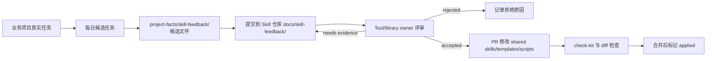

# Skill 反哺自动化运行手册

日期：2026-06-17

本机 kit 更新、项目升级、自动化 prompt 和维护仓库校验命令见 [Project Facts Kit 更新命令速查](project-facts-kit-update-commands.zh-CN.md)。

## 原则

- `Skill` 提升接手效率和执行下限。
- `project-facts/` 保证不偏离项目真实情况。
- PR 审阅保证经验不会未经确认变成团队规则。

这个流程的目标是让真实项目经验持续进入共享 Skill，但不让 AI 自己改制度。业务项目每天产出可评审候选；Skill 仓库负责评审候选；只有通过审阅和检查的变化才进入共享 `skills/`、模板、脚本或 CLI。

受控循环的简写是：业务项目生成候选，Skill 仓库评审候选，PR 审阅决定是否进入共享规则。

## 角色分工

| 位置 | 自动任务可做 | 自动任务不可做 |
| --- | --- | --- |
| 业务项目 | 读取当天任务记录、`project-facts/changes/`、`handover/`、`evidence.md`、`skill-feedback/` 和 `docs/skill-performance-log.md`，生成候选记录 | 修改共享 Skill、把候选写成 `APPROVED`、把项目专属规则写入通用 Skill |
| Skill 仓库 | 汇总 `docs/skill-feedback/` 和 backlog，检查证据、状态、适用范围和 reviewer 结论 | 在没有 owner 审阅时把候选标为 `accepted`，或直接修改正式 Skill |
| PR 审阅 | 判断候选是否通用、是否证据充分、是否需要改 Skill 或工具 | 用 AI 总结替代 Tool/library owner 结论 |

## 业务项目每日候选任务

建议每天工作结束后运行一次，例如北京时间 18:30。任务输出写到业务项目的 `project-facts/skill-feedback/`，一条候选一份文件。

在 Codex app 里，这类任务由 cron automation 触发。automation 只需要一个入口目录：可以是单个业务仓库、业务父目录，或 Codex app 当前打开的 workspace。任务自己根据当天证据定位具体子仓库，不要求普通使用者手动列出每个业务仓库路径。

如果入口目录下面有多个 Git 仓库，任务按下面顺序定位候选归属：

1. 读取父目录 `AGENTS.md`、`docs/ai-context-workspace-map.md`、`docs/ai-context-scope-report.md`、`ai-context-kit doctor --workspace .` 的仓库角色和 capability status。
2. 读取当天 `git status --short`、`git log --since=midnight --name-only`、`project-facts/changes/`、`handover/`、`evidence.md`、`verification.md`、`project-facts/skill-feedback/` 和 `docs/skill-performance-log.md`。
3. 用文件路径、模块名、页面、endpoint、Controller、DTO、API wrapper、包名、错误日志路径和最近改动判断目标子仓库。
4. 能明确归属时，写入对应子仓库的 `project-facts/skill-feedback/`。
5. 多个子仓库各自有证据时，分别写候选；归属冲突或证据不足时，只在运行报告里列为待确认，不猜测写入。

标准提示词可以由 CLI 生成：

```bash
ai-context-kit automation-prompt --workspace /absolute/path/to/workspace --type skill-feedback-candidate
```

推荐提示词：

```text
读取今天新增或修改的 project-facts/changes、project-facts/handover、project-facts/skill-feedback、docs/skill-performance-log.md 和 evidence 记录。

如果当前工作目录是业务父目录，先根据 AGENTS.md、workspace map、git status、最近提交、文件路径、模块名、页面名、endpoint、Controller、DTO、API wrapper、包名和错误日志定位目标子仓库。
能明确归属时，把候选写到对应子仓库的 project-facts/skill-feedback/；多个子仓库各自有证据时分别写；归属冲突或证据不足时，只在最终报告列待确认项，不猜测写入。

如项目使用 ai-context-kit，先读取 `ai-context-kit doctor --workspace <path>` 的 capability status 和 `ai-context-kit token-status --workspace <path>`，只把缺失、过期或误导状态整理成候选证据，不自动执行初始化或修改共享 Skill。

只整理可以反哺到共享 Skill 的候选项，不修改正式 Skill、模板、脚本、CLI 或项目事实批准状态。

每个候选项必须包含：来源任务、涉及 Skill、观察到的有用行为、缺失行为、误导行为、工具冲突、证据路径、实际验证结果、是否跨项目适用、是否可能只是项目专属规则、建议进入哪个 Skill 小节。

证据不足标为 needs-evidence；否则标为 proposed。输出候选记录到 project-facts/skill-feedback/，一条候选一份文件。没有候选时，写一条简短运行记录，说明读取了哪些入口和为什么没有候选。
```

候选文件必须保留这些字段：

| 字段 | 要求 |
| --- | --- |
| Candidate ID | `SFC-YYYYMMDD-short-name` |
| Candidate status | `proposed` 或 `needs-evidence` |
| Source task | 任务、PR、issue、变更目录或会话记录 |
| Evidence paths | 相关文件、命令、报告或日志路径 |
| Verification result | `Pass`、`Fail` 或 `Not run`，不能省略 |
| Applicability | 是否跨项目适用，是否只是项目专属规则 |
| Review | 初始保持 `Pending` |

## Skill 仓库评审任务

建议每天或每周运行一次，取决于候选量。它读取本仓库的 `docs/skill-feedback/`、`docs/skill-iteration-backlog.zh-CN.md`、相关证据和 `AGENTS.md`，只产出评审建议或 backlog 更新，不直接改正式 Skill。

推荐提示词：

```text
读取 docs/skill-feedback/、docs/skill-iteration-backlog.zh-CN.md、相关 evidence 和本仓库 AGENTS.md。

只评审候选项是否有真实任务来源、验证结果、跨项目适用性和 reviewer 结论；不要直接修改 shared skills。

把候选分为 proposed、needs-evidence、accepted、rejected。只有有 Tool/library owner 审阅记录且证据充分的候选，才可建议后续 PR 修改 skills、template、scripts 或 CLI。

输出 review notes 和 backlog 更新建议。没有 owner 审阅记录时，只能建议 needs-evidence 或 proposed。
```

## PR 合并门槛

修改 `skills/`、`template/`、`scripts/` 或本制度正文时，PR 至少满足：

- 链接 `docs/skill-feedback/` 候选文件或 `docs/skill-iteration-backlog.zh-CN.md` 对应行。
- 说明候选来自哪个真实任务，以及验证是否执行。
- Tool/library owner 审阅通过。
- `./scripts/check-kit.sh` 通过。
- `git diff --check` 通过。
- 若修改了 Skill，并且本机有 Agent Skills 校验工具，运行该工具；没有工具时在 PR 或交付说明写明未验证。

推荐 GitHub 设置：

| 设置 | 目的 |
| --- | --- |
| CODEOWNERS 覆盖 `skills/`、`template/`、`scripts/`、`docs/skill-feedback/` 和 CODEOWNERS 文件本身 | 自动请求 Tool/library owner 审阅 |
| 分支保护要求 PR review | 防止直接推送共享规则 |
| Require review from Code Owners | 让 owner 审阅成为合并条件 |
| Require status checks | 把 `check-kit` 和必要测试变成合并条件 |
| Require conversation resolution | 确认评审意见已经处理 |

## Codex App 自动化设置

在 Codex app 中，普通使用者不需要理解 automation 字段。推荐对 Agent 说：

```text
帮我开启每日 Skill 反哺候选总结，从当前 workspace 自动识别业务仓库。
```

Agent 有 Codex app automation 能力时，按当前打开目录创建或更新 cron automation。入口优先级：

1. 当前打开目录就是业务仓库：`cwds` 使用该仓库。
2. 当前打开目录是业务父目录：`cwds` 使用父目录，让 prompt 自动定位子仓库。
3. 团队有多个固定业务父目录：`cwds` 可以配置多个父目录。
4. 当前目录是本 Skill 仓库：不要把它当作业务候选入口；只配置 Skill 仓库评审任务。

业务项目候选任务建议字段：

| 字段 | 建议值 |
| --- | --- |
| kind | `cron` |
| executionEnvironment | `local` |
| cwds | 当前业务仓库、业务父目录或多个业务父目录 |
| schedule | 每天北京时间 18:30 |
| prompt | 使用 `ai-context-kit automation-prompt --type skill-feedback-candidate` 生成的提示词 |

不要让候选任务从本资料库路径去整理业务项目候选。入口目录必须覆盖业务项目资料，但不要求细到每个子仓库。任务识别不清时写待确认，不写错仓库。

本 Skill 仓库可以再创建一个 cron automation：

| 字段 | 建议值 |
| --- | --- |
| kind | `cron` |
| executionEnvironment | `local` |
| cwd | 本仓库路径 |
| schedule | 每天北京时间 19:00，或每周固定时间 |
| prompt | 使用“Skill 仓库评审任务”的提示词，或 `ai-context-kit automation-prompt --type skill-feedback-review` 生成的提示词 |

自动任务的产物仍需要走 Git diff、PR、CODEOWNERS 和检查命令。它可以让候选和评审材料定期出现，但不能让 AI 绕过审阅直接改变共享规则。

当前本机已经存在一条 Skill 仓库评审 cron automation，id 是 `skill`，工作日 19:00 触发，cwd 指向本仓库。业务项目的 daily candidate automation 需要在业务项目或业务父目录中创建；创建后由 prompt 自动识别子仓库。

## 失败处理

| 情况 | 处理 |
| --- | --- |
| 当天没有任务证据 | 不生成候选，写运行记录即可 |
| 只有聊天或 AI 总结 | 标为 `needs-evidence` |
| 候选明显是项目专属规则 | 留在业务项目 `project-facts/`，本仓库标为 `rejected` 或不接收 |
| 验证未执行 | 写 `Not run`，不能写 Pass |
| owner 未审阅 | 不得标为 `accepted` |
| 检查失败 | 不合并，记录失败命令和输出摘要 |

## 流程图



## 已接入项目怎么调整

如果项目里已经装了这套 Skill，调整顺序建议是：

1. 先跑升级命令，保留已有项目事实，只刷新共享 Skill、缺失模板和必要脚本。
2. 如果生成了 `project-facts/AGENTS.fragment.latest.md`，只合并和本项目相关的几条规则。
3. 给项目补上 `project-facts/skill-feedback/` 和 `docs/skill-performance-log.md`，让每天的总结先落成候选。
4. 让 Agent 在当前业务仓库或业务父目录上开启每日候选任务；多仓库父目录由任务自动定位子仓库。
5. 候选进入本资料库后，再由 Tool/library owner 评审；通过后才改共享 Skill。

如果旧项目里已经有一份比较宽的 Skill，先别急着收紧它。先把候选和评审跑起来，再看哪些规则真的是跨项目通用，哪些只是那个项目的局部做法。

## 新项目怎么引入

新项目建议直接按下面顺序起步：

1. 运行 `./scripts/install-project-facts.sh /path/to/project --lite`。
2. 把生成的 `project-facts/AGENTS.fragment.md` 合并进项目根 `AGENTS.md`。
3. 先填 `project-facts/project.md`、`runtime.md`、`iteration-plan.md`、`handover/current.md`。
4. 给 `project-facts/skill-feedback/` 留出位置，开始收候选。
5. 需要持续反哺时，让 Agent 在项目仓库或业务父目录上开启每日候选任务。
6. 把 `docs/skill-feedback-automation-runbook.zh-CN.md` 的评审任务放到共享 Skill 仓库里。

新项目的关键不是把资料一次性填满，而是先把事实入口、验证入口和候选入口立住。

## 同事怎么用

给同事的最短用法是三句入口：

| 场景 | 推荐说法 |
| --- | --- |
| 新项目第一次接入 | `帮我做项目事实 kit 首次接入。` |
| 已接入项目升级 | `帮我做项目事实 kit 已接入升级，不覆盖已有事实。` |
| 每日 Skill 反哺 | `帮我开启每日 Skill 反哺候选总结，从当前 workspace 自动识别业务仓库。` |

接手项目时再遵守这些规则：

1. 先读根 `AGENTS.md`。
2. 再读 `project-facts/README.md`、`project.md`、`runtime.md`、`iteration-plan.md` 和当前域的 `spec.md`。
3. 只把代码现状写成 `OBSERVED`，别直接写成已批准需求。
4. 发现可复用的 Skill 改进点时，写候选文件，不直接改共享 Skill。
5. 看见 reviewer 或 owner 没确认的内容，先放回候选区。

这样同事接手时会先看到事实和验证，再看到工作方式，不容易把一轮临时经验当成长期规则。
